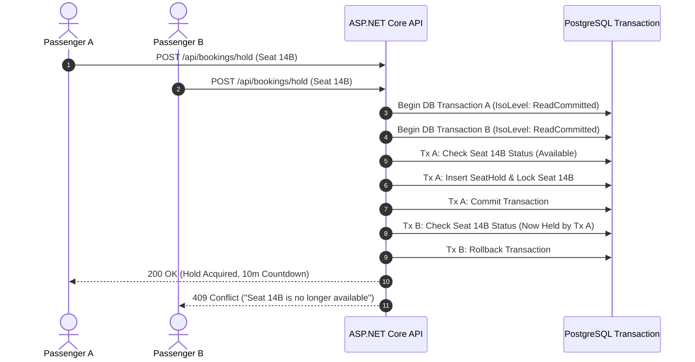

# WayPoint Comprehensive REST API Contract Specification

This document defines the complete RESTful API contract for the **WayPoint** AI-Powered Intercity Journey Planner & Bus Operations Platform (**SE3090 Assignment 1**).

---

## 1. REST API Architecture Principles & DTO Isolation

- **Base Path**: `/api/v1`
- **Data Transfer Isolation**: Database entities are NEVER exposed directly in request or response contracts. All interactions use strongly-typed Data Transfer Objects (DTOs) with FluentValidation / DataAnnotations.
- **Authentication**: JWT Bearer Tokens (`Authorization: Bearer <token>`).
- **Server-Side Authorization**: Enforced via ASP.NET Core `[Authorize(Roles = "...")]` attributes.
- **Server-Side Validation**: All incoming request DTOs undergo server-side validation before reaching business logic.

---

## 2. Global Pagination, Filtering, Sorting & Search Conventions

Query endpoints that return collections support standard pagination, filtering, sorting, and search query parameters:

- **Pagination**: `pageNumber` (default: 1), `pageSize` (default: 20, max: 100).
- **Sorting**: `sortBy` (e.g., `DepartureTime`, `TotalFare`), `sortOrder` (`asc` or `desc`).
- **Filtering**: Query string parameters (e.g., `?routeId=...&status=Scheduled`).
- **Search**: `searchTerm` (full-text search across names, codes, landmarks).

### Standard Paginated Response DTO (`PaginatedResponseDto<T>`)
```json
{
  "items": [ ... ],
  "pageNumber": 1,
  "pageSize": 20,
  "totalPages": 5,
  "totalCount": 94,
  "hasPreviousPage": false,
  "hasNextPage": true
}
```

---

## 3. Standard Error Contract (`ProblemDetails` RFC 7807)

All error responses strictly follow RFC 7807 standard JSON payload format:

```json
{
  "type": "https://waypoint.lk/errors/concurrency-conflict",
  "title": "Seat Hold Conflict",
  "status": 409,
  "detail": "Seat 14B on service SRV-COL-ELLA-0800 was reserved by another user.",
  "instance": "/api/v1/bookings/hold",
  "errors": {
    "seatNumbers": ["Seat 14B is no longer available."]
  }
}
```

---

## 4. Comprehensive Endpoint Contract Directory

---

### 4.1 Authentication (`/api/auth`)

#### `POST /api/auth/register`
- **Purpose**: Register a new user account.
- **Roles**: Anonymous.
- **Request DTO (`UserRegistrationDto`)**: `{ email, password, fullName, phoneNumber, role }`.
- **Response DTO (`UserResponseDto`)**: `{ userId, email, fullName, role, createdAt }`.
- **Validation**: Valid email format, password complexity ($\ge 8$ chars, upper/lower/number/special).
- **Success Status**: `201 Created`.
- **Error Statuses**: `400 Bad Request`, `409 Conflict` (duplicate email).
- **Business Rules**: `BR-AUTH-001` (BCrypt password hashing).

#### `POST /api/auth/login`
- **Purpose**: Authenticate user and issue JWT bearer token.
- **Roles**: Anonymous.
- **Request DTO (`LoginRequestDto`)**: `{ email, password }`.
- **Response DTO (`AuthResponseDto`)**: `{ token, expiresAt, user: { userId, email, fullName, role } }`.
- **Validation**: Email and password fields required.
- **Success Status**: `200 OK`.
- **Error Statuses**: `400 Bad Request`, `401 Unauthorized`.
- **Business Rules**: `BR-AUTH-002` (5 failed logins trigger 15-min lockout).

---

### 4.2 User Management (`/api/users`)

#### `GET /api/users/me`
- **Purpose**: Retrieve current authenticated user profile.
- **Roles**: Passenger, Operator, TransportManager, Admin.
- **Request DTO**: None (Token claim).
- **Response DTO (`UserProfileDto`)**: `{ userId, email, fullName, phoneNumber, role, profileDetails }`.
- **Success Status**: `200 OK`.
- **Error Statuses**: `401 Unauthorized`.

#### `PUT /api/users/me`
- **Purpose**: Update user profile information.
- **Roles**: Passenger, Operator, TransportManager, Admin.
- **Request DTO (`UpdateProfileDto`)**: `{ fullName, phoneNumber }`.
- **Response DTO (`UserProfileDto`)**: Updated user profile.
- **Success Status**: `200 OK`.
- **Error Statuses**: `400 Bad Request`, `401 Unauthorized`.

---

### 4.3 Route Catalogue (`/api/routes`) — *Component 1*

#### `GET /api/routes`
- **Purpose**: List and filter intercity transport routes.
- **Roles**: Anonymous, Passenger, Operator, TransportManager, Admin.
- **Request Parameters**: `originCity`, `destinationCity`, `pageNumber`, `pageSize`.
- **Response DTO**: `PaginatedResponseDto<RouteSummaryDto>`.
- **Success Status**: `200 OK`.

#### `POST /api/routes`
- **Purpose**: Create a new intercity route with ordered stops.
- **Roles**: Operator, Admin.
- **Request DTO (`CreateRouteDto`)**: `{ routeCode, name, originCity, destinationCity, totalDistanceKm, stops: [{ stopName, sequenceOrder, arrivalOffsetMinutes, distanceKm }] }`.
- **Response DTO (`RouteDetailDto`)**: Complete route object with stops.
- **Validation**: `RouteCode` unique, stop sequences strictly sequential ($1, 2, 3...$).
- **Success Status**: `201 Created`.
- **Error Statuses**: `400 Bad Request`, `401 Unauthorized`, `403 Forbidden`, `409 Conflict`.

#### `GET /api/routes/{id}`
- **Purpose**: Retrieve detailed route structure including intermediate stops and boarding points.
- **Roles**: Anonymous, Passenger, Operator, TransportManager, Admin.
- **Response DTO (`RouteDetailDto`)**: Route details and ordered stops array.
- **Success Status**: `200 OK`.
- **Error Statuses**: `404 Not Found`.

---

### 4.4 Intermediate Stops (`/api/stops`) — *Component 1*

#### `GET /api/stops`
- **Purpose**: Search intermediate route stops.
- **Roles**: Anonymous, Passenger, Operator, Admin.
- **Request Parameters**: `searchTerm`, `routeId`.
- **Response DTO**: `List<StopSummaryDto>`.
- **Success Status**: `200 OK`.

---

### 4.5 Boarding & Drop-Off Points (`/api/boarding-points`) — *Component 1*

#### `GET /api/boarding-points`
- **Purpose**: List pickup landmarks and GPS coordinates for a route.
- **Roles**: Anonymous, Passenger, Operator.
- **Request Parameters**: `routeId`.
- **Response DTO**: `List<BoardingPointDto>`: `{ id, pointName, landmark, latitude, longitude }`.
- **Success Status**: `200 OK`.

---

### 4.6 Services & Timetables (`/api/services`) — *Component 1*

#### `GET /api/services`
- **Purpose**: List scheduled bus departures.
- **Roles**: Anonymous, Passenger, Operator, TransportManager, Admin.
- **Request Parameters**: `routeId`, `date`, `status`, `pageNumber`, `pageSize`.
- **Response DTO**: `PaginatedResponseDto<ServiceSummaryDto>`.
- **Success Status**: `200 OK`.

#### `POST /api/services`
- **Purpose**: Schedule a new departure service.
- **Roles**: Operator, Admin.
- **Request DTO (`CreateServiceDto`)**: `{ serviceCode, routeId, busId, driverId, departureTime, arrivalTime, baseFare }`.
- **Response DTO (`ServiceDetailDto`)**: Service details.
- **Validation**: Departure in future, non-overlapping bus and driver schedules (`BR-TIME-001`).
- **Success Status**: `201 Created`.
- **Error Statuses**: `400 Bad Request`, `409 Conflict` (schedule overlap).

---

### 4.7 Journey Planning Engine (`/api/journeys`) — *Component 1 Business Operation*

#### `POST /api/journeys/search`
- **Purpose**: **Business-Specific Operation**. Generate direct and connecting candidate journeys and rank by passenger preferences.
- **Roles**: Anonymous, Passenger.
- **Request DTO (`JourneySearchRequestDto`)**: `{ originStopId, destinationStopId, travelDate, passengerCount, preferences: { arrivalBeforeTime, directServiceOnly, requireAc, requireWifi } }`.
- **Response DTO (`JourneySearchResultDto`)**: `{ searchId, totalCandidatesFound, candidateJourneys: [{ journeyId, isDirect, totalDurationMinutes, totalFare, matchScore, legs: [...] }] }`.
- **Validation**: Travel date $\ge$ today, origin $\neq$ destination, minimum 20-min transfer window enforced (`BR-TRANSFER-001`).
- **Success Status**: `200 OK`.
- **Error Statuses**: `400 Bad Request`.

---

### 4.8 Bus Fleet Inventory (`/api/buses`) — *Component 2*

#### `GET /api/buses`
- **Purpose**: List fleet buses and maintenance status.
- **Roles**: Operator, TransportManager, Admin.
- **Request Parameters**: `busClass`, `isUnderMaintenance`, `pageNumber`, `pageSize`.
- **Response DTO**: `PaginatedResponseDto<BusSummaryDto>`.
- **Success Status**: `200 OK`.

#### `POST /api/buses`
- **Purpose**: Register a new bus vehicle in fleet.
- **Roles**: Operator, Admin.
- **Request DTO (`CreateBusDto`)**: `{ registrationNumber, busClass, totalSeatCapacity, seatLayoutId }`.
- **Response DTO (`BusDetailDto`)**: Created bus record.
- **Validation**: Registration number unique.
- **Success Status**: `201 Created`.
- **Error Statuses**: `400 Bad Request`, `409 Conflict`.

---

### 4.9 Seat Layout Templates & Real-Time Seats (`/api/seats`) — *Component 2*

#### `POST /api/seats/layouts`
- **Purpose**: Define visual seat layout matrix template.
- **Roles**: Operator, Admin.
- **Request DTO (`CreateSeatLayoutDto`)**: `{ name, totalRows, totalColumns, seats: [{ seatNumber, rowIndex, columnIndex, seatClass }] }`.
- **Response DTO (`SeatLayoutDto`)**: Created template.
- **Success Status**: `201 Created`.

#### `GET /api/services/{serviceId}/seats`
- **Purpose**: **Real-Time Seat Map Endpoint**. Calculate real-time seat availability map for a service.
- **Roles**: Anonymous, Passenger, Operator.
- **Response DTO (`SeatMapResponseDto`)**: `{ serviceId, totalSeats, availableCount, heldCount, bookedCount, seatMatrix: [{ seatId, seatNumber, rowIndex, columnIndex, seatClass, status: "Available"|"Held"|"Booked" }] }`.
- **Business Rules**: `BR-SEAT-001` (authoritative backend calculation).
- **Success Status**: `200 OK`.

---

### 4.10 Driver Management (`/api/drivers`) — *Component 2*

#### `GET /api/drivers`
- **Purpose**: List driver directory and active assignments.
- **Roles**: Operator, TransportManager, Admin.
- **Response DTO**: `PaginatedResponseDto<DriverSummaryDto>`.
- **Success Status**: `200 OK`.

---

### 4.11 Resource Feasibility (`/api/resources`) — *Component 2 Business Operation*

#### `POST /api/resources/replacement-feasibility`
- **Purpose**: **Business-Specific Operation**. Evaluate unassigned buses, seat capacity, and driver rest hours for disruption replacement.
- **Roles**: Operator, TransportManager, AI Agent.
- **Request DTO (`ResourceFeasibilityRequestDto`)**: `{ disruptedServiceId, requiredSeatCapacity, requiredDepartureTime }`.
- **Response DTO (`ResourceFeasibilityResponseDto`)**: `{ isFeasible, feasibleBuses: [{ busId, registrationNumber, seatCapacity }], feasibleDrivers: [{ driverId, fullName, restHoursCompleted }] }`.
- **Business Rules**: `BR-RESOURCE-001` (capacity match), `BR-RESOURCE-002` (8h driver rest).
- **Success Status**: `200 OK`.

---

### 4.12 Bookings (`/api/bookings`) — *Component 3*

#### `POST /api/bookings/hold`
- **Purpose**: **Concurrency-Sensitive Operation**. Request temporary 10-minute seat hold lock.
- **Roles**: Passenger.
- **Request DTO (`SeatHoldRequestDto`)**: `{ serviceId, seatNumbers: ["14A", "14B"] }`.
- **Response DTO (`SeatHoldResponseDto`)**: `{ holdId, serviceId, seatNumbers, heldAt, expiresAt, remainingSeconds }`.
- **Validation**: Seats must be `Available`. Enforced via `IDbContextTransaction`.
- **Success Status**: `200 OK`.
- **Error Statuses**: `400 Bad Request`, `409 Conflict` (seat already held/booked).

#### `GET /api/bookings/my-bookings`
- **Purpose**: List passenger booking history.
- **Roles**: Passenger.
- **Response DTO**: `PaginatedResponseDto<BookingSummaryDto>`.
- **Success Status**: `200 OK`.

#### `POST /api/bookings/cancel`
- **Purpose**: Cancel eligible booking and compute refund amount.
- **Roles**: Passenger.
- **Request DTO (`CancelBookingDto`)**: `{ bookingId, cancellationReason }`.
- **Response DTO (`CancellationResultDto`)**: `{ bookingId, isCancelled, refundAmount, refundPercentage, policyExplanation }`.
- **Business Rules**: `BR-CANCEL-001`, `BR-REFUND-001`.
- **Success Status**: `200 OK`.

---

### 4.13 Payments (`/api/payments`) — *Component 3 Business Operation*

#### `POST /api/payments/confirm-sandbox-charge`
- **Purpose**: **Business-Specific & Concurrency-Sensitive Operation**. Execute payment sandbox charge and convert seat hold to confirmed booking inside DB transaction.
- **Roles**: Passenger.
- **Request DTO (`PaymentConfirmRequestDto`)**: `{ holdId, paymentMethodToken, amount }`.
- **Response DTO (`BookingConfirmationDto`)**: `{ bookingId, bookingReference, serviceId, seatNumbers, totalFare, paymentStatus: "Success", ticket: { ticketId, qrCodePayload } }`.
- **Business Rules**: `BR-BOOK-001`, `BR-BOOK-002`, `BR-PAY-001`.
- **Success Status**: `200 OK`.
- **Error Statuses**: `400 Bad Request`, `402 Payment Required`, `409 Conflict`.

---

### 4.14 Digital E-Tickets (`/api/tickets`) — *Component 3*

#### `GET /api/tickets/{id}`
- **Purpose**: Retrieve digital e-ticket and QR code payload.
- **Roles**: Passenger.
- **Response DTO (`TicketDetailDto`)**: `{ ticketId, bookingReference, serviceDetails, seatNumbers, qrCodePayload, isBoarded }`.
- **Success Status**: `200 OK`.

#### `POST /api/tickets/verify`
- **Purpose**: Boarding QR code scanning verification.
- **Roles**: Operator.
- **Request DTO (`VerifyTicketDto`)**: `{ qrCodePayload }`.
- **Response DTO (`TicketVerificationResultDto`)**: `{ isValid, bookingReference, passengerName, seatNumbers, boardingStatus: "Boarded" }`.
- **Success Status**: `200 OK`.
- **Error Statuses**: `400 Bad Request` (tampered/invalid QR), `409 Conflict` (already scanned).

---

### 4.15 Disruption Management (`/api/disruptions`) — *Component 4*

#### `POST /api/disruptions`
- **Purpose**: Log a service disruption event.
- **Roles**: Operator, TransportManager.
- **Request DTO (`CreateDisruptionDto`)**: `{ serviceId, reason, severity: "Minor"|"Major"|"Critical" }`.
- **Response DTO (`DisruptionCaseDto`)**: `{ disruptionId, serviceId, severity, affectedPassengerCount, status: "Logged" }`.
- **Success Status**: `201 Created`.

#### `GET /api/disruptions/{id}`
- **Purpose**: View disruption case details and affected passenger list.
- **Roles**: Operator, TransportManager.
- **Response DTO (`DisruptionDetailDto`)**: Case details and affected passenger count.
- **Success Status**: `200 OK`.

---

### 4.16 AI Rebooking Engine (`/api/rebooking`) — *Component 4 Business Operation*

#### `POST /api/rebooking/generate-proposal`
- **Purpose**: **Business-Specific Operation**. Initiate Level 4 AI multi-agent workflow to analyze disruptions and generate rebooking proposals.
- **Roles**: Operator, TransportManager, System.
- **Request DTO (`GenerateRebookingProposalDto`)**: `{ disruptionCaseId }`.
- **Response DTO (`RebookingProposalDto`)**: `{ proposalId, disruptionCaseId, replacementServiceId, proposedByAgent, affectedPassengerCount, status: "PendingManagerApproval" }`.
- **Business Rules**: `BR-APPROVAL-001` (gates high-impact changes).
- **Success Status**: `202 Accepted` / `200 OK`.

---

### 4.17 Transport Manager Approvals (`/api/approvals`) — *Component 4*

#### `GET /api/approvals/pending`
- **Purpose**: Retrieve queue of high-impact proposals in `PendingManagerApproval` state.
- **Roles**: TransportManager.
- **Response DTO**: `List<PendingApprovalSummaryDto>`.
- **Success Status**: `200 OK`.

#### `POST /api/approvals/{id}/decision`
- **Purpose**: Execute Transport Manager `Approve`, `Reject`, or `RequestRevision` decision.
- **Roles**: TransportManager.
- **Request DTO (`ApprovalDecisionRequestDto`)**: `{ decision: "Approve"|"Reject"|"RequestRevision", managerComments, managerSignature }`.
- **Response DTO (`ApprovalDecisionResultDto`)**: `{ approvalId, proposalId, decision, executedAt, affectedPassengersRebooked }`.
- **Business Rules**: `BR-APPROVAL-002`, `BR-APPLY-001`.
- **Success Status**: `200 OK`.

---

### 4.18 Notifications (`/api/notifications`)

#### `GET /api/notifications/my-notifications`
- **Purpose**: Retrieve passenger disruption and booking alerts.
- **Roles**: Passenger.
- **Response DTO**: `List<NotificationDto>`.
- **Success Status**: `200 OK`.

---

### 4.19 AI Workflows (`/api/ai/workflows`)

#### `GET /api/ai/workflows/{id}`
- **Purpose**: Retrieve execution trace, tool logs, timings, and validation outcomes for an AI workflow.
- **Roles**: Operator, TransportManager, Admin.
- **Response DTO (`AiWorkflowTraceDto`)**: `{ workflowId, objective, currentStatus, steps: [{ agentName, stepOrder, toolCalls: [{ toolName, durationMs, resultJson }], validationResults: [{ ruleName, passed }] }] }`.
- **Success Status**: `200 OK`.

---

## 5. Assignment Component Compliance Matrix

| Component Ownership | Required Minimum Endpoints | Provided Endpoint Contracts | Business-Specific Complex Operation Beyond CRUD |
| :--- | :--- | :--- | :--- |
| **Component 1 (Student 1)**<br>Journey Planning & Route Catalogue | $\ge 4$ Endpoints | 1. `GET /api/routes`<br>2. `POST /api/routes`<br>3. `GET /api/services`<br>4. `POST /api/services` | **`POST /api/journeys/search`**: Multi-leg candidate generator & preference ranking engine with 20-min transfer window enforcement. |
| **Component 2 (Student 2)**<br>Fleet, Seat & Resource Feasibility | $\ge 4$ Endpoints | 1. `GET /api/buses`<br>2. `POST /api/buses`<br>3. `POST /api/seats/layouts`<br>4. `GET /api/drivers` | **`POST /api/resources/replacement-feasibility`**: Replacement fleet capacity matching & driver schedule rest hour solver. |
| **Component 3 (Student 3)**<br>Booking, Ticketing & Passenger Options | $\ge 4$ Endpoints | 1. `POST /api/bookings/hold`<br>2. `GET /api/bookings/my-bookings`<br>3. `POST /api/bookings/cancel`<br>4. `GET /api/tickets/{id}` | **`POST /api/payments/confirm-sandbox-charge`**: Transactional seat hold validation, sandbox payment, seat locking, & QR ticket generation (`IDbContextTransaction`). |
| **Component 4 (Student 4)**<br>Disruption, Rebooking & Approval | $\ge 4$ Endpoints | 1. `POST /api/disruptions`<br>2. `GET /api/disruptions/{id}`<br>3. `GET /api/approvals/pending`<br>4. `POST /api/approvals/{id}/decision` | **`POST /api/rebooking/generate-proposal`**: Level 4 AI multi-agent workflow orchestration & `PendingManagerApproval` gate state machine. |

---

## 6. Concurrency-Sensitive Operations Specification



1. **Seat Hold Lock (`POST /api/bookings/hold`)**:
   - Executes inside `IDbContextTransaction`.
   - Uses PostgreSQL row-level locks (`SELECT FOR UPDATE`).
   - If seat is `Available`, inserts `SeatHold` record with `HeldUntil = UtcNow + 10m`.
   - If concurrent request attempts same seat, second transaction detects lock conflict and returns `409 Conflict`.

2. **Booking Confirmation (`POST /api/payments/confirm-sandbox-charge`)**:
   - Verifies active valid `SeatHold` (`HeldUntil > UtcNow`).
   - Processes sandbox payment gateway authorization.
   - Executes single database transaction converting hold to confirmed `Booking`, marking seat status `Booked`, and generating `Ticket` with QR payload.
   - On payment failure, transaction rolls back and releases seat hold.

---

## 7. Contract Review: Gaps, Overlaps, Security Concerns & Consistency Analysis

### 7.1 Identified Gaps & Mitigations
- *Gap*: Initial contract lacked an explicit ticket scanning endpoint for bus drivers.
- *Mitigation*: Added `POST /api/tickets/verify` supporting mobile camera scanning and real-time boarding updates.

### 7.2 Overlap Analysis
- *Potential Overlap*: Route search (`GET /api/routes`) vs. Journey Candidate Search (`POST /api/journeys/search`).
- *Resolution*: `GET /api/routes` is a simple administrative listing endpoint; `POST /api/journeys/search` is the complex, preference-aware journey planning engine computing multi-leg options.

### 7.3 Security Concerns & Controls
- *Concern*: Malicious users attempting to confirm bookings for expired seat holds.
- *Control*: Server-side validation inside `IDbContextTransaction` enforces `HeldUntil > UtcNow`.
- *Concern*: Unauthorized passengers attempting to inspect other users' e-tickets.
- *Control*: Endpoint `GET /api/tickets/{id}` verifies `Booking.PassengerId == Token.UserId`.

### 7.4 Consistency Verification
- All endpoints use DTOs (zero raw entity exposure).
- All DTO payloads follow camelCase naming conventions.
- All error responses follow standard RFC 7807 `ProblemDetails` structures.
