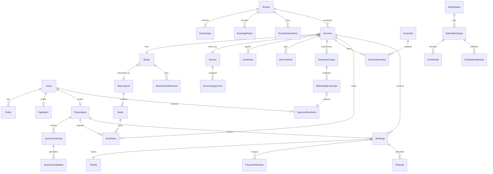

# WayPoint Complete PostgreSQL Database & ERD Specification

This document provides the complete, authoritative **Database Design Specification** for the **WayPoint** AI-Powered Intercity Journey Planner & Bus Operations Platform (**SE3090 Assignment 1**).

---

## 1. Entity Relationship Diagram (ERD)

---

## 2. Mandatory vs. Optional Entities Classification

To maintain high technical quality without overengineering, entities are classified into **Mandatory Core** (essential for assignment compliance and core workflows) and **Supporting/Optional** (enhancements for domain richness).

| Entity Name | Classification | Assignment & System Purpose |
| :--- | :--- | :--- |
| **`User`**, **`Role`** | **Mandatory** | Core authentication and Role-Based Access Control (RBAC). |
| **`Operator`**, **`Passenger`** | **Mandatory** | User profiles for web workspace staff and mobile app passengers. |
| **`Route`**, **`RouteStop`** | **Mandatory** | Intercity transit network, intermediate stops, sequence ordering. |
| **`BoardingPoint`** | **Supporting** | GPS coordinates and landmark descriptions for passenger pickup. |
| **`TouristDestination`** | **Supporting** | Tourist corridor highlights (e.g., Sigiriya, Nine Arch Bridge). |
| **`Service`**, **`FareRule`** | **Mandatory** | Departure timetables, service listings, fare pricing structure. |
| **`Amenity`**, **`ServiceAmenity`** | **Supporting** | Bus facility tags (AC, Wi-Fi, Reclining Seats, USB Charging). |
| **`Bus`**, **`SeatLayout`**, **`Seat`** | **Mandatory** | Fleet inventory, visual seat matrix, seat classification. |
| **`Driver`**, **`DriverAssignment`** | **Mandatory** | Driver management, schedule assignment, overlap validation. |
| **`MaintenanceRecord`** | **Supporting** | Fleet maintenance logging and bus availability flags. |
| **`JourneySearch`**, **`JourneyCandidate`**| **Mandatory** | Search query history and deterministic/AI candidate options. |
| **`SeatHold`** | **Mandatory** | Short-lived 10-minute temporary seat locks with concurrency protection. |
| **`Booking`**, **`Ticket`** | **Mandatory** | Transactional seat reservation, booking refs, QR e-tickets. |
| **`PaymentAttempt`**, **`Refund`** | **Mandatory** | Payment sandbox transactions and cancellation refund calculations. |
| **`ServiceAlert`** | **Supporting** | Public passenger transit notices and delay announcements. |
| **`DisruptionCase`** | **Mandatory** | Disruption event logging, severity levels, affected passenger count. |
| **`RebookingProposal`** | **Mandatory** | AI-generated replacement journey plans under disruption. |
| **`ApprovalDecision`** | **Mandatory** | Transport Manager sign-off for high-impact operational changes. |
| **`AiWorkflow`**, **`AiWorkflowStep`** | **Mandatory** | Level 4 multi-agent state persistence and execution history. |
| **`AiToolCall`**, **`AiValidationResult`**| **Mandatory** | Tool execution traces and deterministic rule validation assertions. |
| **`AuditLog`** | **Mandatory** | Immutable system-wide audit trail for compliance and evaluation. |

---

## 3. Critical State Management Architecture

The database model explicitly enforces state machine lifecycles across 11 key operational domains:

1. **Seat Concurrency**: Enforced via PostgreSQL bytea `xmin` / `RowVersion` concurrency tokens on `Seats` and `SeatHolds` inside `IDbContextTransaction`.
2. **Seat Hold Expiration**: `SeatHold.Status`: `Held` $\rightarrow$ `Expired` OR `ConvertedToBooking`. Controlled by `HeldUntil` timestamp check.
3. **Booking Lifecycle State**: `Booking.Status`: `PendingPayment` $\rightarrow$ `Confirmed` $\rightarrow$ `Rebooked` OR `Cancelled`.
4. **Payment State**: `PaymentAttempt.Status`: `Pending` $\rightarrow$ `Success` OR `Failed` OR `Refunded`.
5. **Ticket State**: `Ticket.Status`: `Issued` $\rightarrow$ `Boarded` OR `Cancelled`. Verified via QR code HMAC signature.
6. **Service Departure State**: `Service.Status`: `Scheduled` $\rightarrow$ `Boarding` $\rightarrow$ `InTransit` $\rightarrow$ `Completed` OR `Disrupted` OR `Cancelled`.
7. **Disruption State**: `DisruptionCase.Status`: `Logged` $\rightarrow$ `Analyzing` $\rightarrow$ `PendingApproval` $\rightarrow$ `Resolved` OR `Cancelled`.
8. **Rebooking Proposal State**: `RebookingProposal.Status`: `Proposed` $\rightarrow$ `Approved` $\rightarrow$ `Rejected` $\rightarrow$ `Executed`.
9. **Manager Approval Gate State**: `ApprovalDecision.Status`: `PendingManagerApproval` $\rightarrow$ `Approved` OR `Rejected` OR `RevisionRequested`.
10. **AI Workflow Execution State**: `AiWorkflow.Status`: `Running` $\rightarrow$ `PendingManagerApproval` $\rightarrow$ `Completed` OR `SafeFailure`.
11. **Auditability**: Immutable `AuditLogs` table appending `Timestamp`, `ActorId`, `ActionType`, `BeforeStateJson`, `AfterStateJson` without `UPDATE`/`DELETE` permissions.

---

## 4. Complete Table Specifications (32 Entities)

### 4.1 Core Identity & User Entities

#### 1. `Users`
- **Purpose**: Central user identity for authentication and RBAC.
- **Fields**: `Id` (UUID, PK), `Email` (VARCHAR(150), Unique, Not Null), `PasswordHash` (VARCHAR(255), Not Null), `FullName` (VARCHAR(100), Not Null), `PhoneNumber` (VARCHAR(20)), `RoleId` (UUID, FK), `IsActive` (BOOLEAN, Default true), `CreatedAt` (TIMESTAMPTZ), `UpdatedAt` (TIMESTAMPTZ).
- **Constraints**: Unique index on `Email`.
- **Indexes**: `IX_Users_Email`.

#### 2. `Roles`
- **Purpose**: System role definitions (`Passenger`, `Operator`, `TransportManager`, `Admin`).
- **Fields**: `Id` (UUID, PK), `RoleName` (VARCHAR(50), Unique, Not Null), `Description` (VARCHAR(255)).
- **Uniqueness**: `RoleName` must be unique.

#### 3. `Operators`
- **Purpose**: Extended profile for bus operator staff and dispatchers.
- **Fields**: `Id` (UUID, PK), `UserId` (UUID, FK to `Users`, Unique), `OperatorCode` (VARCHAR(30), Unique), `CompanyName` (VARCHAR(100)), `AssignedRegion` (VARCHAR(50)).

#### 4. `Passengers`
- **Purpose**: Extended profile for travel passengers.
- **Fields**: `Id` (UUID, PK), `UserId` (UUID, FK to `Users`, Unique), `NicOrPassport` (VARCHAR(30)), `EmergencyContact` (VARCHAR(20)).

---

### 4.2 Route Catalogue & Timetable Entities

#### 5. `Routes`
- **Purpose**: Intercity route corridor definitions.
- **Fields**: `Id` (UUID, PK), `RouteCode` (VARCHAR(20), Unique, Not Null), `Name` (VARCHAR(100), Not Null), `OriginCity` (VARCHAR(50), Not Null), `DestinationCity` (VARCHAR(50), Not Null), `TotalDistanceKm` (DECIMAL(8,2), Not Null), `IsActive` (BOOLEAN, Default true).
- **Indexes**: `IX_Routes_Origin_Dest` on `(OriginCity, DestinationCity)`.

#### 6. `RouteStops`
- **Purpose**: Intermediate stops along a route.
- **Fields**: `Id` (UUID, PK), `RouteId` (UUID, FK to `Routes`), `StopName` (VARCHAR(100), Not Null), `SequenceOrder` (INT, Not Null), `ArrivalOffsetMinutes` (INT, Not Null), `DistanceFromOriginKm` (DECIMAL(8,2), Not Null).
- **Constraints**: Unique constraint on `(RouteId, SequenceOrder)`.

#### 7. `BoardingPoints`
- **Purpose**: Designated passenger pickup/drop-off locations with GPS coordinates.
- **Fields**: `Id` (UUID, PK), `RouteId` (UUID, FK to `Routes`), `PointName` (VARCHAR(100), Not Null), `Landmark` (VARCHAR(150)), `Latitude` (DECIMAL(10,8)), `Longitude` (DECIMAL(11,8)).

#### 8. `TouristDestinations`
- **Purpose**: Tourist corridor attraction points linked to routes.
- **Fields**: `Id` (UUID, PK), `RouteId` (UUID, FK to `Routes`), `AttractionName` (VARCHAR(100), Not Null), `Description` (TEXT), `ImageUrl` (VARCHAR(255)).

#### 9. `Services`
- **Purpose**: Scheduled bus departure listings.
- **Fields**: `Id` (UUID, PK), `ServiceCode` (VARCHAR(30), Unique, Not Null), `RouteId` (UUID, FK to `Routes`), `BusId` (UUID, FK to `Buses`), `DriverId` (UUID, FK to `Drivers`), `DepartureTime` (TIMESTAMPTZ, Not Null), `ArrivalTime` (TIMESTAMPTZ, Not Null), `BaseFare` (DECIMAL(10,2), Not Null), `Status` (VARCHAR(30), Default `'Scheduled'`).
- **Status Options**: `Scheduled`, `Boarding`, `InTransit`, `Completed`, `Disrupted`, `Cancelled`.
- **Indexes**: `IX_Services_Route_Date` on `(RouteId, DepartureTime, Status)`.

#### 10. `FareRules`
- **Purpose**: Distance and class-based segment pricing structure.
- **Fields**: `Id` (UUID, PK), `ServiceId` (UUID, FK to `Services`), `BusClass` (VARCHAR(30)), `RatePerKm` (DECIMAL(8,2)), `ClassMultiplier` (DECIMAL(4,2), Default 1.0).

#### 11. `Amenities` & 12. `ServiceAmenities`
- **Purpose**: Bus facility tags (AC, Wi-Fi, Reclining Seats).
- **Fields**: `Id` (UUID, PK), `Name` (VARCHAR(50), Unique), `IconCode` (VARCHAR(30)); Join table `ServiceAmenities(ServiceId, AmenityId)`.

---

### 4.3 Fleet, Seat & Resource Management Entities

#### 13. `Buses`
- **Purpose**: Bus fleet vehicle inventory.
- **Fields**: `Id` (UUID, PK), `RegistrationNumber` (VARCHAR(30), Unique, Not Null), `BusClass` (VARCHAR(30), Not Null), `TotalSeatCapacity` (INT, Not Null), `SeatLayoutId` (UUID, FK to `SeatLayouts`), `IsUnderMaintenance` (BOOLEAN, Default false).

#### 14. `SeatLayouts` & 15. `Seats`
- **Purpose**: Visual seat layout matrices and individual seat definitions.
- **Fields (`SeatLayouts`)**: `Id` (UUID, PK), `Name` (VARCHAR(50)), `TotalRows` (INT), `TotalColumns` (INT).
- **Fields (`Seats`)**: `Id` (UUID, PK), `SeatLayoutId` (UUID, FK), `SeatNumber` (VARCHAR(10), Not Null), `RowIndex` (INT), `ColumnIndex` (INT), `SeatClass` (VARCHAR(20), Default `'Standard'`), `RowVersion` (bytea / Concurrency Token).
- **Constraints**: Unique `(SeatLayoutId, SeatNumber)`.

#### 16. `Drivers` & 17. `DriverAssignments`
- **Purpose**: Driver directory and schedule assignments.
- **Fields (`Drivers`)**: `Id` (UUID, PK), `FullName` (VARCHAR(100)), `LicenseNumber` (VARCHAR(50), Unique), `PhoneNumber` (VARCHAR(20)), `Status` (VARCHAR(20), Default `'Active'`).
- **Fields (`DriverAssignments`)**: `Id` (UUID, PK), `DriverId` (UUID, FK), `ServiceId` (UUID, FK), `AssignedAt` (TIMESTAMPTZ).
- **Constraints**: Unique constraint on `(DriverId, ServiceId)`.

#### 18. `MaintenanceRecords`
- **Purpose**: Vehicle maintenance logs.
- **Fields**: `Id` (UUID, PK), `BusId` (UUID, FK), `Description` (TEXT), `StartedAt` (TIMESTAMPTZ), `CompletedAt` (TIMESTAMPTZ, Nullable), `Cost` (DECIMAL(10,2)).

---

### 4.4 Journey Search & Candidate Generation Entities

#### 19. `JourneySearches` & 20. `JourneyCandidates`
- **Purpose**: Search query logs and generated direct/connecting journey candidate options.
- **Fields (`JourneySearches`)**: `Id` (UUID, PK), `PassengerId` (UUID, FK, Nullable), `OriginCity` (VARCHAR(50)), `DestinationCity` (VARCHAR(50)), `TravelDate` (DATE), `PassengerCount` (INT), `SearchedAt` (TIMESTAMPTZ).
- **Fields (`JourneyCandidates`)**: `Id` (UUID, PK), `JourneySearchId` (UUID, FK), `CandidateType` (VARCHAR(20) - `Direct` or `Connecting`), `TotalFare` (DECIMAL(10,2)), `TotalDurationMinutes` (INT), `MatchScore` (DECIMAL(4,3)).

---

### 4.5 Booking, Ticketing & Financial Entities

#### 21. `SeatHolds`
- **Purpose**: Short-lived 10-minute temporary seat locks.
- **Fields**: `Id` (UUID, PK), `ServiceId` (UUID, FK), `SeatId` (UUID, FK), `PassengerId` (UUID, FK), `HeldAt` (TIMESTAMPTZ), `HeldUntil` (TIMESTAMPTZ), `Status` (VARCHAR(20), Default `'Held'`).
- **Status Options**: `Held`, `Expired`, `ConvertedToBooking`.
- **Indexes**: `IX_SeatHolds_Lookup` on `(ServiceId, SeatId, HeldUntil, Status)`.

#### 22. `Bookings`
- **Purpose**: Confirmed passenger seat reservations.
- **Fields**: `Id` (UUID, PK), `BookingReference` (VARCHAR(20), Unique, Not Null), `PassengerId` (UUID, FK), `ServiceId` (UUID, FK), `SeatNumbers` (VARCHAR(50)), `TotalFareAmount` (DECIMAL(10,2)), `Status` (VARCHAR(30), Default `'Confirmed'`), `CreatedAt` (TIMESTAMPTZ).
- **Status Options**: `PendingPayment`, `Confirmed`, `Rebooked`, `Cancelled`.

#### 23. `Tickets`
- **Purpose**: Digital e-tickets and QR payloads.
- **Fields**: `Id` (UUID, PK), `BookingId` (UUID, FK, Unique), `QrCodePayload` (TEXT, Not Null), `Status` (VARCHAR(20), Default `'Issued'`), `IsBoarded` (BOOLEAN, Default false), `BoardedAt` (TIMESTAMPTZ, Nullable).
- **Status Options**: `Issued`, `Boarded`, `Cancelled`.

#### 24. `PaymentAttempts` & 25. `Refunds`
- **Purpose**: Payment sandbox transaction logs and cancellation refund processing.
- **Fields (`PaymentAttempts`)**: `Id` (UUID, PK), `BookingId` (UUID, FK), `GatewayTransactionId` (VARCHAR(100)), `Amount` (DECIMAL(10,2)), `Status` (VARCHAR(20) - `Pending`, `Success`, `Failed`), `ProcessedAt` (TIMESTAMPTZ).
- **Fields (`Refunds`)**: `Id` (UUID, PK), `BookingId` (UUID, FK), `RefundAmount` (DECIMAL(10,2)), `Percentage` (DECIMAL(5,2)), `Reason` (VARCHAR(100)), `ProcessedAt` (TIMESTAMPTZ).

---

### 4.6 Disruption, Rebooking & Manager Approval Entities

#### 26. `ServiceAlerts`
- **Purpose**: Public passenger transit notices.
- **Fields**: `Id` (UUID, PK), `ServiceId` (UUID, FK), `Title` (VARCHAR(100)), `Message` (TEXT), `PostedAt` (TIMESTAMPTZ).

#### 27. `DisruptionCases`
- **Purpose**: Service disruption event logs.
- **Fields**: `Id` (UUID, PK), `DisruptedServiceId` (UUID, FK), `Reason` (TEXT), `Severity` (VARCHAR(20) - `Minor`, `Major`, `Critical`), `AffectedPassengerCount` (INT), `Status` (VARCHAR(30), Default `'Logged'`).
- **Status Options**: `Logged`, `Analyzing`, `PendingApproval`, `Resolved`, `Cancelled`.

#### 28. `RebookingProposals`
- **Purpose**: AI-generated replacement journey plans under disruption.
- **Fields**: `Id` (UUID, PK), `DisruptionCaseId` (UUID, FK), `ReplacementServiceId` (UUID, FK), `ProposedByAgent` (VARCHAR(50)), `Status` (VARCHAR(30), Default `'PendingManagerApproval'`).
- **Status Options**: `Proposed`, `PendingManagerApproval`, `Approved`, `Rejected`, `Executed`.

#### 29. `ApprovalDecisions`
- **Purpose**: Transport Manager formal sign-off records.
- **Fields**: `Id` (UUID, PK), `RebookingProposalId` (UUID, FK, Unique), `ManagerId` (UUID, FK), `Decision` (VARCHAR(30) - `Approve`, `Reject`, `RequestRevision`), `Comments` (TEXT), `DecidedAt` (TIMESTAMPTZ).

---

### 4.7 Agentic AI State & Audit Trail Entities

#### 30. `AiWorkflows`
- **Purpose**: Multi-agent execution workflow state.
- **Fields**: `Id` (UUID, PK), `Objective` (TEXT), `Status` (VARCHAR(30), Default `'Running'`), `StartedAt` (TIMESTAMPTZ), `CompletedAt` (TIMESTAMPTZ, Nullable).
- **Status Options**: `Running`, `PendingManagerApproval`, `Completed`, `SafeFailure`.

#### 31. `AiWorkflowSteps`
- **Purpose**: Execution steps logged by specialized agents.
- **Fields**: `Id` (UUID, PK), `AiWorkflowId` (UUID, FK), `AgentName` (VARCHAR(50)), `StepOrder` (INT), `StepDescription` (TEXT), `ExecutedAt` (TIMESTAMPTZ).

#### 32. `AiToolCalls` & `AiValidationResults`
- **Purpose**: Tool invocation traces and deterministic validation assertions.
- **Fields (`AiToolCalls`)**: `Id` (UUID, PK), `AiWorkflowStepId` (UUID, FK), `ToolName` (VARCHAR(50)), `ArgumentsJson` (JSONB), `ResultJson` (JSONB), `DurationMs` (INT), `ExecutedAt` (TIMESTAMPTZ).
- **Fields (`AiValidationResults`)**: `Id` (UUID, PK), `AiWorkflowStepId` (UUID, FK), `RuleName` (VARCHAR(50)), `Passed` (BOOLEAN), `ValidationDetails` (TEXT).

#### 33. `AuditLogs`
- **Purpose**: Immutable system-wide audit trail.
- **Fields**: `Id` (UUID, PK), `Timestamp` (TIMESTAMPTZ, Default `UtcNow`), `ActorId` (VARCHAR(100)), `ActionType` (VARCHAR(50)), `EntityName` (VARCHAR(50)), `EntityId` (VARCHAR(100)), `BeforeStateJson` (JSONB), `AfterStateJson` (JSONB).

---

## 5. Functional Requirement Coverage Review

The proposed 32-entity database schema was systematically reviewed against every functional requirement area to confirm 100% coverage:

- `FR-AUTH` (Authentication & RBAC): Supported by `Users`, `Roles`.
- `FR-JOURNEY` (Journey Search & Routes): Supported by `Routes`, `RouteStops`, `BoardingPoints`, `TouristDestinations`, `Services`, `FareRules`, `JourneySearches`, `JourneyCandidates`.
- `FR-FLEET` (Fleet & Seat Availability): Supported by `Buses`, `SeatLayouts`, `Seats`, `Drivers`, `DriverAssignments`, `MaintenanceRecords`, `Amenities`, `ServiceAmenities`.
- `FR-BOOKING` (Hold, Payment & Tickets): Supported by `SeatHolds`, `Bookings`, `Tickets`, `PaymentAttempts`, `Refunds`.
- `FR-DISRUPTION` (Disruptions & Approvals): Supported by `ServiceAlerts`, `DisruptionCases`, `RebookingProposals`, `ApprovalDecisions`.
- `FR-AI` (Agent Workflows & Tools): Supported by `AiWorkflows`, `AiWorkflowSteps`, `AiToolCalls`, `AiValidationResults`.
- `FR-AUDIT` (Auditability): Supported by `AuditLogs`.

*Conclusion: The database design completely covers all functional requirements without unnecessary bloat.*
