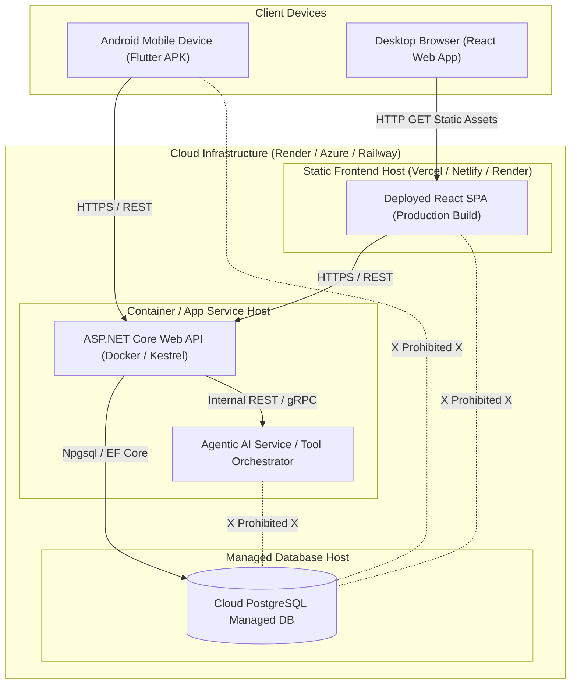

# WayPoint Deployment Architecture Specification

This document defines the deployment topology, cloud infrastructure strategy, containerization, and evaluation availability specs for **WayPoint** (**SE3090 Assignment 1**).

---

## 1. Deployment Topology

WayPoint uses a cloud-hosted infrastructure topology. All public client requests flow into the ASP.NET Core API.

---

## 2. Component Deployment Details

### 2.1 ASP.NET Core Web API
- **Deployment Platform**: Render / Azure App Service / Railway (Docker container or .NET runtime).
- **Public Health Endpoint**: `GET https://<api-host>/health` returning `200 OK` with DB status.
- **Swagger Documentation URL**: `https://<api-host>/swagger`.
- **Environment Configuration**: DB connection strings and JWT secrets loaded from cloud environment variables.

### 2.2 PostgreSQL Managed Cloud Database
- **Deployment Platform**: Managed PostgreSQL instance (e.g., Render Postgres / Supabase / Azure Database for PostgreSQL).
- **Initialization**: Database schema initialized automatically via Entity Framework Core migrations (`dotnet ef database update`) during deployment.
- **Access Credentials**: Private network access or SSL-enforced credentials with restricted user privileges.

### 2.3 React Web Application
- **Deployment Platform**: Vercel / Netlify / Render static hosting.
- **Configuration**: Compiled production build configured to communicate with the deployed cloud API URL (`VITE_API_URL`).

### 2.4 Flutter Mobile Application
- **Deliverable**: Compiled Android Application Package (`.apk`) file.
- **Build Command**: `flutter build apk --release`.
- **Distribution**: APK file included in submission package alongside installation instructions.

### 2.5 Agentic AI Subsystem
- **Deployment**: Deployed as an internal service on cloud container host or documented for local execution.
- **Startup Sequence**:
  1. PostgreSQL Database instance started and migrations applied.
  2. ASP.NET Core Web API instance started.
  3. AI Orchestrator service started connected to API tool runner. *(Note: This step applies only if `ADR-003` selects Option B — Python LangGraph microservice. If Option A — C# Semantic Kernel — is selected, the AI subsystem runs embedded within the ASP.NET Core process and no separate service startup is needed.)*

---

## 3. Evaluation Accessibility & Cost Policy

- **No-Cost Policy Compliance**: All cloud hosting uses free-tier or institution-provided cloud resources (`REQ-DEP-06`).
- **Required Access Period**: All live URLs (API, React app, Swagger, DB) and demonstration video links MUST remain fully functional and accessible to evaluators until at least **Wednesday, 21 October 2026** (`REQ-ASSIGN-06`).
