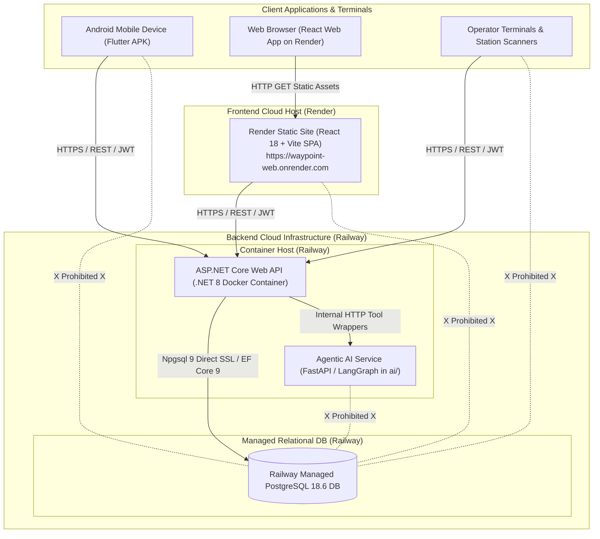

# WayPoint Deployment Architecture Specification

This document defines the deployment topology, cloud infrastructure strategy, containerization, and headless evaluation availability specs for **WayPoint** (**SE3090 Assignment 1**).

---

## 1. Deployment Topology

WayPoint uses an enterprise cloud-hosted headless infrastructure topology on **Railway**. All client requests and integration workflows flow directly into the authoritative ASP.NET Core Web API.

```mermaid
graph TB
    subgraph ClientDevices["Client Applications & Terminals"]
        MobileDevice["Android Mobile Device (Flutter APK)"]
        Browser["Web Browser (React Web App on Render)"]
        Operators["Operator Terminals & Station Scanners"]
    end

    subgraph StaticHosting["Frontend Cloud Host (Render)"]
        RenderStatic["Render Static Site (React 18 + Vite SPA)\nhttps://waypoint-web.onrender.com"]
    end

    subgraph CloudInfra["Backend Cloud Infrastructure (Railway)"]
        subgraph ContainerHosting["Container Host (Railway)"]
            APIApp["ASP.NET Core Web API (.NET 8 Docker Container)"]
            AIModule["Agentic AI Service (FastAPI / LangGraph in ai/)"]
        end

        subgraph ManagedDB["Managed Relational DB (Railway)"]
            PostgresCloud[(Railway Managed PostgreSQL 18.6 DB)]
        end
    end

    Browser -->|HTTP GET Static Assets| RenderStatic
    RenderStatic -->|HTTPS / REST / JWT| APIApp
    MobileDevice -->|HTTPS / REST / JWT| APIApp
    Operators -->|HTTPS / REST / JWT| APIApp
    APIApp -->|Npgsql 9 Direct SSL / EF Core 9| PostgresCloud
    APIApp -->|Internal HTTP Tool Wrappers| AIModule

    %% No direct access
    RenderStatic -. X Prohibited X .- PostgresCloud
    MobileDevice -. X Prohibited X .- PostgresCloud
    Operators -. X Prohibited X .- PostgresCloud
    AIModule -. X Prohibited X .- PostgresCloud
```

---

## 2. Component Deployment Details

### 2.1 ASP.NET Core Web API
- **Deployment Platform**: Railway (Linux Docker container running .NET 8 Kestrel).
- **Public Health Endpoint**: `GET https://<railway-host>/health` returning `200 OK` with database connectivity status (`REQ-DEP-01`).
- **Interactive Swagger Documentation URL**: `https://<railway-host>/swagger` providing live execution and testing for all 4 student components.
- **Environment Configuration**: `DATABASE_URL` (private Railway database URL with SSL ALPN), `JWT_SECRET`, and `CORS_ORIGINS` loaded via Railway service variables.

### 2.2 PostgreSQL Managed Cloud Database
- **Deployment Platform**: Railway Managed PostgreSQL Database service (PostgreSQL 18.6).
- **Initialization**: Database schema initialized automatically via Entity Framework Core migrations applied on startup (`context.Database.MigrateAsync()`).
- **Direct SSL & ALPN**: Fully configured via **Npgsql 9** with `SslNegotiation = SslNegotiation.Direct` and ALPN `postgresql`.
- **Access Credentials**: Private internal host networking within the Railway project environment.

### 2.3 React Web Application
- **Deployment Platform**: **Render** (Static Site service).
- **Configuration**: Root directory `web`, build command `npm install && npm run build`, publish directory `dist`.
- **Environment Variable**: `VITE_API_URL` set to the Railway Web API domain (`https://<railway-domain>/api/v1`).
- **SPA Rewrite Rule**: Rewrite `/*` to `/index.html` (configured via root `render.yaml`) ensuring deep links resolve without 404 errors.
- **Continuous Deployment**: Automated git-push tracking on `main` branch.

### 2.4 Headless API Consumption & Interactive Swagger Console
- **Evaluator Access**: Real-time evaluation of all transit routes, seat matrices, bookings, refunds, and multi-agent AI mitigation is facilitated via the interactive Swagger/OpenAPI 3.0 interface (`/swagger`).
- **Client Agnostic**: Any HTTP client (Postman, cURL, third-party mobile clients, automated load test scripts) can execute authenticated requests using JWT Bearer headers.

### 2.5 Agentic AI Subsystem
- **Deployment Platform**: Internal Python container service in `ai/` connected via private internal HTTP to ASP.NET Core.
- **Startup Sequence**:
  1. Railway Managed PostgreSQL Database instance verified active.
  2. ASP.NET Core Web API instance started, migrations applied, baseline data seeded.
  3. Python LangGraph agent service initialized connected to internal backend tool callbacks.

---

## 3. Evaluation Accessibility & Cost Policy

- **No-Cost Policy Compliance**: All cloud hosting uses free-tier or institution-provided cloud resources (`REQ-DEP-06`).
- **Required Access Period**: All live URLs (API, Swagger UI, DB health) MUST remain fully functional and accessible to evaluators until at least **Wednesday, 21 October 2026** (`REQ-ASSIGN-06`).
