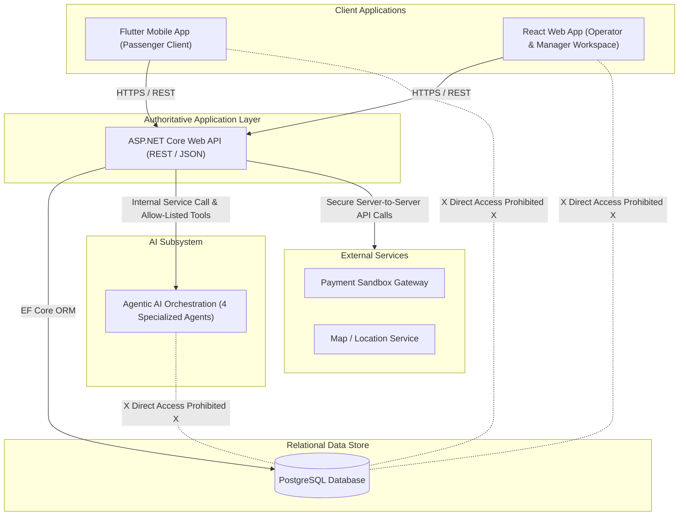

# WayPoint System Architecture Specification

This document defines the high-level system architecture, component design, layer responsibilities, and system boundaries for the **WayPoint** AI-Powered Intercity Journey Planner & Bus Operations Platform (**SE3090 Assignment 1**).

---

## 1. High-Level Architecture Overview

WayPoint is designed as an integrated multi-tier software system. The **ASP.NET Core Web API** acts as the single authoritative backend layer for both client applications and external services.



---

## 2. Clean Architecture Layer Responsibilities

The ASP.NET Core backend enforces a strict **Clean Architecture** pattern to ensure testability, maintainability, and domain separation without overengineering:

```mermaid
graph TB
    subgraph BackendArchitecture["ASP.NET Core Backend (Clean Architecture Layers)"]
        subgraph APILayer["1. API Layer (Web API)"]
            Controllers["REST Controllers"]
            Middlewares["Auth, JWT, CORS, Error Middleware"]
            SwaggerDocs["Swagger / OpenAPI"]
        end

        subgraph AppLayer["2. Application Layer"]
            Services["Application Services & Handlers"]
            DTOs["DTO Models & Validations"]
            ToolRunner["AI Tool Runner Wrappers"]
        end

        subgraph DomainLayer["3. Domain Layer"]
            Entities["Domain Entities & Enums"]
            ValueObjects["Value Objects"]
            DomainRules["Business Rule Assertions"]
        end

        subgraph InfraLayer["4. Infrastructure Layer"]
            DbContext["WayPointDbContext (EF Core)"]
            Repositories["EF Repositories"]
            ExternalProxies["Payment & Map Service Proxies"]
        end
    end

    APILayer --> AppLayer
    AppLayer --> DomainLayer
    AppLayer --> InfraLayer
    InfraLayer --> DomainLayer
```



### Layer Responsibility Summary

| Layer / Technology | Primary Responsibilities | Dependencies Allowed |
| :--- | :--- | :--- |
| **1. API Layer** (ASP.NET Core Controllers) | HTTP routing, request deserialization, response formatting, status codes, JWT authentication middleware, CORS policies, Swagger/OpenAPI documentation. | Application Layer. |
| **2. Application Layer** (Use Cases & Services) | Orchestrates application workflows, processes DTOs, executes AI tool wrappers, manages transactional boundaries, handles DTO validation. | Domain Layer, Infrastructure Interfaces. |
| **3. Domain Layer** (Entities & Business Rules) | Core business entities (`Route`, `Bus`, `Booking`, `DisruptionCase`), domain enums, immutable value objects, pure business rule assertions (`BR-TRANSFER-001`, `BR-REFUND-001`). Zero external framework dependencies. | None (Pure C#). |
| **4. Infrastructure Layer** (Persistence & External) | `WayPointDbContext` implementation, EF Core entity configurations, database migrations, repository implementations, Payment Sandbox HTTP proxy, Serilog logging. | Domain Layer, Application Layer Interfaces. |
| **5. AI Orchestration Subsystem** | Level 4 multi-agent workflow engine (Planner, Journey Analysis, Resource, Safety Agents), prompt engineering, allow-listed tool execution, workflow state persistence. | Internal API Layer endpoints / application tool contracts. |
| **6. PostgreSQL Database** | Authoritative relational data persistence, primary/foreign key integrity, unique constraints, performance indexes, transaction isolation locks (`IDbContextTransaction`). | None. |
| **7. React Web Application** | Operator/admin workspace, route/fleet CRUD management, disruption workbench, Manager Approval Workbench, AI execution summary monitoring. | ASP.NET Core API via HTTPS/REST. |
| **8. Flutter Mobile Application** | Passenger mobile interface, journey search, preference filters, interactive seat picker, payment sandbox checkout, digital QR e-ticket wallet, device feature integration. | ASP.NET Core API via HTTPS/REST. |

---

## 3. System Boundaries & Control Isolation

WayPoint enforces strict architectural boundaries to guarantee security, data integrity, and compliance:

```text
+-----------------------------------------------------------------------------------+
|                             SYSTEM BOUNDARIES & ISOLATION                         |
+-----------------------------------------------------------------------------------+

[ Client Boundary ]       --> React & Flutter MUST consume only public ASP.NET Core API.
                              Direct database connections are strictly prohibited.

[ Database Boundary ]     --> PostgreSQL is accessible ONLY via EF Core from ASP.NET Core.
                              Zero direct connections allowed from frontend or AI services.

[ AI Isolation Boundary ] --> AI models operate through allow-listed tools.
                              AI CANNOT execute direct SQL, shell code, or unlisted tools.

[ Validation Boundary ]   --> Server-side ASP.NET Core validators inspect all DTO inputs and
                              AI tool outputs BEFORE applying business logic or DB changes.

[ Approval Boundary ]     --> High-impact operational changes (service cancellation, major
                              timetable shifts) pause in PendingManagerApproval state.

[ Audit Boundary ]        --> Immutable database logs record all manager decisions, high-impact
                              mutations, and AI tool execution traces automatically.
```

1. **Authentication Boundary**: Managed exclusively via JWT bearer tokens issued by ASP.NET Core upon credential verification.
2. **Authorization Boundary**: Managed via role claims (`Passenger`, `Operator`, `TransportManager`, `Admin`) evaluated by ASP.NET Core middleware (`[Authorize(Roles = "...")]`).
3. **API Boundary**: Public HTTPS REST interface exposed with Swagger documentation. All payload data transfer uses validated DTO models.
4. **Database Boundary**: PostgreSQL is completely private inside the backend network. No frontend client or AI agent has database access credentials.
5. **AI Boundary**: AI agents execute strictly inside an allow-listed sandbox containing 10 predefined tool wrappers.
6. **Validation Boundary**: Server-side C# code validates all client request payloads and AI tool outputs against deterministic business rules (`BR-VAL-001`).
7. **Approval Boundary**: State machine enforces that high-impact operations transition to `PendingManagerApproval` until signed by a Transport Manager (`BR-APPROVAL-001`).
8. **Audit Boundary**: DB interceptors append immutable audit logs (`AuditLogs`, `AiToolCall`) for every state change without delete/update capabilities (`BR-AUDIT-001`).
