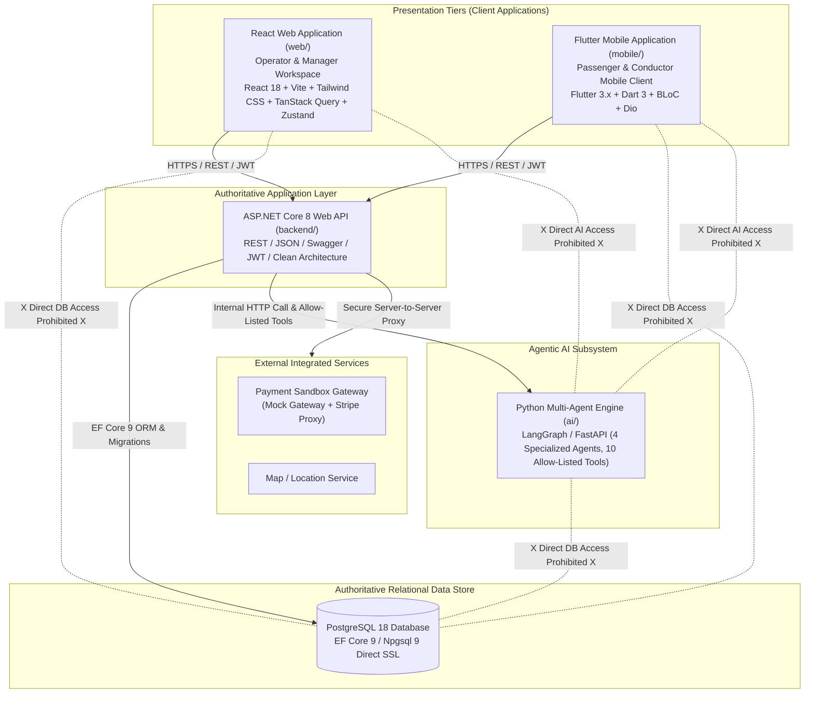
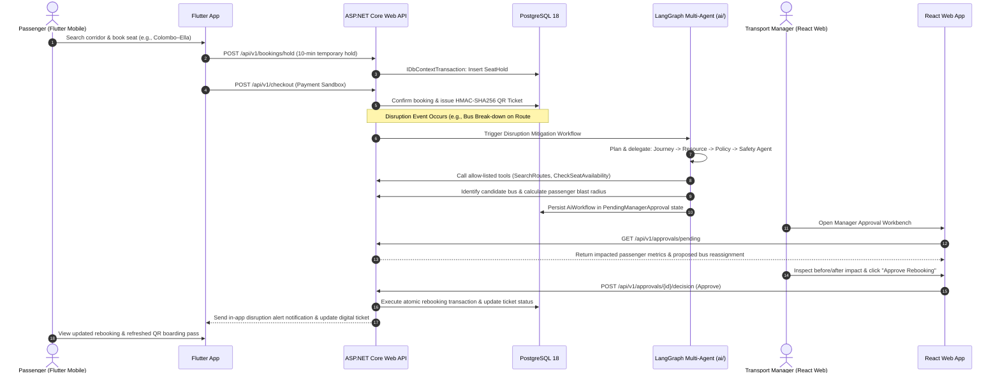

# WayPoint System Architecture Specification

This document defines the high-level system architecture, component design, layer responsibilities, and system boundaries for the **WayPoint** AI-Powered Intercity Journey Planner & Bus Operations Platform (**SE3090 Assignment 1**).

---

## 1. High-Level Architecture Overview

WayPoint is designed as a fully integrated multi-tier software system adhering to **SE3090 Assignment 1 Specification Section 10 (Figure 1 & Figure 2)**. The **ASP.NET Core Web API** acts as the single authoritative backend layer for both client applications and external services.


```mermaid
graph TD
    subgraph Clients["Presentation Tiers (Client Applications)"]
        WebClient["React Web Application (web/)\nOperator & Manager Workspace\nReact 18 + Vite + Tailwind CSS + TanStack Query + Zustand"]
        MobileClient["Flutter Mobile Application (mobile/)\nPassenger & Conductor Mobile Client\nFlutter 3.x + Dart 3 + BLoC + Dio"]
    end

    subgraph Backend["Authoritative Application Layer"]
        API["ASP.NET Core 8 Web API (backend/)\nREST / JSON / Swagger / JWT / Clean Architecture"]
    end

    subgraph Storage["Authoritative Relational Data Store"]
        Postgres[(PostgreSQL 18 Database\nEF Core 9 / Npgsql 9 Direct SSL)]
    end

    subgraph AI["Agentic AI Subsystem"]
        Orchestration["Python Multi-Agent Engine (ai/)\nLangGraph / FastAPI (4 Specialized Agents, 10 Allow-Listed Tools)"]
    end

    subgraph External["External Integrated Services"]
        Payment["Payment Sandbox Gateway\n(Mock Gateway + Stripe Proxy)"]
        Maps["Map / Location Service"]
    end

    WebClient -->|HTTPS / REST / JWT| API
    MobileClient -->|HTTPS / REST / JWT| API
    API -->|EF Core 9 ORM & Migrations| Postgres
    API -->|Internal HTTP Call & Allow-Listed Tools| Orchestration
    API -->|Secure Server-to-Server Proxy| External

    %% Boundary Violations (Prohibited Connections per REQ-ASSIGN-04)
    WebClient -. X Direct DB Access Prohibited X .- Postgres
    MobileClient -. X Direct DB Access Prohibited X .- Postgres
    Orchestration -. X Direct DB Access Prohibited X .- Postgres
    WebClient -. X Direct AI Access Prohibited X .- Orchestration
    MobileClient -. X Direct AI Access Prohibited X .- Orchestration
```

---

## 2. Integrated Cross-Platform Workflow Pattern (SE3090 Figure 2)

Per **`REQ-TEST-05`** and Assignment Specification Section 10 (Figure 2), WayPoint demonstrates a closed-loop cross-platform workflow spanning all five system tiers:


```mermaid
sequenceDiagram
    autonumber
    actor Passenger as Passenger (Flutter Mobile)
    participant Mobile as Flutter App
    participant API as ASP.NET Core Web API
    participant DB as PostgreSQL 18
    participant AI as LangGraph Multi-Agent (ai/)
    actor Manager as Transport Manager (React Web)
    participant Web as React Web App

    Passenger->>Mobile: Search corridor & book seat (e.g., Colombo–Ella)
    Mobile->>API: POST /api/v1/bookings/hold (10-min temporary hold)
    API->>DB: IDbContextTransaction: Insert SeatHold
    Mobile->>API: POST /api/v1/checkout (Payment Sandbox)
    API->>DB: Confirm booking & issue HMAC-SHA256 QR Ticket
    Note over API,DB: Disruption Event Occurs (e.g., Bus Break-down on Route #EX-01)
    API->>AI: Trigger Disruption Mitigation Workflow
    AI->>AI: Plan & delegate: Journey -> Resource -> Policy -> Safety Agent
    AI->>API: Call allow-listed tools (SearchRoutes, CheckSeatAvailability)
    AI->>API: Identify candidate bus & calculate passenger blast radius
    AI->>DB: Persist AiWorkflow in PendingManagerApproval state
    Manager->>Web: Open Manager Approval Workbench
    Web->>API: GET /api/v1/approvals/pending
    API-->>Web: Return impacted passenger metrics & proposed bus reassignment
    Manager->>Web: Inspect before/after impact & click "Approve Rebooking"
    Web->>API: POST /api/v1/approvals/{id}/decision (Approve)
    API->>DB: Execute atomic rebooking transaction & update ticket status
    API-->>Mobile: Send in-app disruption alert notification & update digital ticket
    Passenger->>Mobile: View updated rebooking & refreshed QR boarding pass
```

---

## 2. Clean Architecture Layer Responsibilities

The ASP.NET Core backend enforces a strict **Clean Architecture** pattern to ensure testability, maintainability, and domain separation without overengineering:


```mermaid
graph TB
    subgraph BackendArchitecture["ASP.NET Core Backend (Clean Architecture Layers)"]
        subgraph APILayer["1. API Layer (Web API)"]
            Controllers["REST Controllers"]
            Middlewares["Auth, JWT, CORS, Error Middleware"]
            SwaggerDocs["Swagger / OpenAPI"]
        end

        subgraph AppLayer["2. Application Layer"]
            Services["Application Services & Handlers"]
            DTOs["DTO Models & Validations"]
            ToolRunner["AI Tool Runner Wrappers"]
        end

        subgraph DomainLayer["3. Domain Layer"]
            Entities["Domain Entities & Enums"]
            ValueObjects["Value Objects"]
            DomainRules["Business Rule Assertions"]
        end

        subgraph InfraLayer["4. Infrastructure Layer"]
            DbContext["WayPointDbContext (EF Core)"]
            Repositories["EF Repositories"]
            ExternalProxies["Payment & Map Service Proxies"]
        end
    end

    APILayer --> AppLayer
    AppLayer --> DomainLayer
    AppLayer --> InfraLayer
    InfraLayer --> DomainLayer
```

### Layer Responsibility Summary

| Layer / Technology | Primary Responsibilities | Dependencies Allowed |
| :--- | :--- | :--- |
| **1. Web Presentation Tier** (React 18 / Vite / Tailwind CSS) | Operator, Dispatcher & Manager workspace (`web/`). Route catalogue management, service scheduling, fleet matrix builder, seat layout designer, live booking manifest monitor, disruption workbench, manager approval workbench, and AI observability dashboard. | ASP.NET Core API via HTTPS/REST. |
| **2. Mobile Presentation Tier** (Flutter 3.x / Dart 3) | Passenger & Conductor cross-platform client (`mobile/`). Intercity journey search & candidate comparison, dynamic preference filters, real-time 2D bus seat picker (with 10-minute hold countdown), digital QR ticket wallet, conductor camera boarding scanner, review submission. | ASP.NET Core API via HTTPS/REST. |
| **3. API Layer** (ASP.NET Core Controllers) | HTTP routing, request deserialization, response formatting, status codes, JWT authentication middleware, CORS policies, Swagger/OpenAPI documentation (`backend/WayPoint.API`). | Application Layer. |
| **4. Application Layer** (Use Cases & Services) | Orchestrates application workflows, processes DTOs, executes AI tool wrappers, manages transactional boundaries, handles DTO validation (`backend/WayPoint.Application`). | Domain Layer, Infrastructure Interfaces. |
| **5. Domain Layer** (Entities & Business Rules) | Core business entities (`Route`, `Bus`, `Booking`, `DisruptionCase`), domain enums, immutable value objects, pure business rule assertions (`BR-TRANSFER-001`, `BR-REFUND-001`). Zero external framework dependencies (`backend/WayPoint.Domain`). | None (Pure C#). |
| **6. Infrastructure Layer** (Persistence & External) | `WayPointDbContext` implementation, EF Core entity configurations, database migrations, repository implementations, Payment Sandbox HTTP proxy, Serilog logging (`backend/WayPoint.Infrastructure`). Infrastructure **implements interfaces** defined in the Application Layer. | Domain Layer, Application Layer Interfaces. |
| **7. AI Orchestration Subsystem** | Level 4 multi-agent workflow engine (Planner, Journey Analysis, Resource, Safety Agents), prompt engineering, allow-listed tool execution, workflow state persistence (`ai/`). | Internal API Layer endpoints / application tool contracts. |
| **8. PostgreSQL Database** | Authoritative relational data persistence, primary/foreign key integrity, unique constraints, performance indexes, transaction isolation locks (`IDbContextTransaction`). | None (Accessed strictly via EF Core). |

---

## 3. System Boundaries & Control Isolation

WayPoint enforces strict architectural boundaries to guarantee security, data integrity, and compliance:

```text
+-----------------------------------------------------------------------------------+
|                             SYSTEM BOUNDARIES & ISOLATION                         |
+-----------------------------------------------------------------------------------+

[ Client Boundary ]       --> External consumers MUST consume only public ASP.NET Core API.
                              Direct database connections are strictly prohibited.

[ Database Boundary ]     --> PostgreSQL is accessible ONLY via EF Core from ASP.NET Core.
                              Zero direct connections allowed from frontend or AI services.

[ AI Isolation Boundary ] --> AI models operate through allow-listed tools.
                              AI CANNOT execute direct SQL, shell code, or unlisted tools.

[ Validation Boundary ]   --> Server-side ASP.NET Core validators inspect all DTO inputs and
                              AI tool outputs BEFORE applying business logic or DB changes.

[ Approval Boundary ]     --> High-impact operational changes (service cancellation, major
                              timetable shifts) pause in PendingManagerApproval state.

[ Audit Boundary ]        --> Immutable database logs record all manager decisions, high-impact
                              mutations, and AI tool execution traces automatically.
```

1. **Authentication Boundary**: Managed exclusively via JWT bearer tokens issued by ASP.NET Core upon credential verification.
2. **Authorization Boundary**: Managed via role claims (`Passenger`, `Operator`, `TransportManager`, `Admin`) evaluated by ASP.NET Core middleware (`[Authorize(Roles = "...")]`).
3. **API Boundary**: Public HTTPS REST interface exposed with Swagger documentation. All payload data transfer uses validated DTO models.
4. **Database Boundary**: PostgreSQL is completely private inside the backend network. No frontend client or AI agent has database access credentials.
5. **AI Boundary**: AI agents execute strictly inside an allow-listed sandbox containing 10 predefined tool wrappers.
6. **Validation Boundary**: Server-side C# code validates all client request payloads and AI tool outputs against deterministic business rules (`BR-VAL-001`).
7. **Approval Boundary**: State machine enforces that high-impact operations transition to `PendingManagerApproval` until signed by a Transport Manager (`BR-APPROVAL-001`).
8. **Audit Boundary**: DB interceptors append immutable audit logs (`AuditLogs`, `AiToolCall`) for every state change without delete/update capabilities (`BR-AUDIT-001`).
