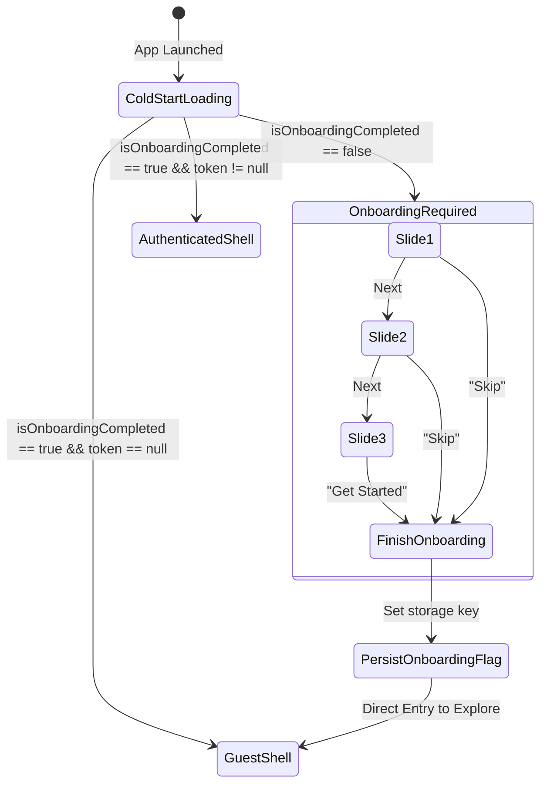

# Mobile App Identity, Onboarding & First-Run Experience Design

## 1. Executive Summary

This design establishes the core visual identity, cold-start splash, onboarding flow, and first-run experience for the **WayPoint Mobile** application (Flutter). It ensures that new passengers are greeted by a unified, high-contrast brand mark, quickly understand the app's value proposition through a 3-step carousel, and can immediately explore Sri Lanka's intercity transit network as guests with guided first-action recommendations. Returning passengers permanently bypass onboarding directly into the application shell.

---

## 2. Goals & Non-Goals

### Goals
- **Authoritative Brand Identity:** Establish [`WayPointLogo`](file:///c:/Users/Nuhad/Documents/GitHub/WayPoint/mobile/lib/core/widgets/waypoint_logo.dart) as the universal brand asset across mobile screens, eliminating ad-hoc icons and legacy naming remnants.
- **Branded Cold Start:** Replace the unbranded fullscreen spinner in [`AuthGate`](file:///c:/Users/Nuhad/Documents/GitHub/WayPoint/mobile/lib/features/navigation/screens/auth_gate.dart) with a clean `BrandedSplashScreen`.
- **Purposeful Onboarding:** Implement a concise 3-slide introduction (`OnboardingScreen`) with skip, progression indicators, and persistent completion tracking via [`SecureStorageService`](file:///c:/Users/Nuhad/Documents/GitHub/WayPoint/mobile/lib/core/storage/secure_storage_service.dart).
- **Frictionless First-Run & Guest Discovery:** Allow new users to explore routes immediately upon completing onboarding without upfront authentication barriers.
- **Actionable First-Run Guidance:** Introduce a dismissible `FirstRunWelcomeCard` on the Explore screen with popular expressway corridors (e.g., Colombo ⇄ Galle, Colombo ⇄ Kandy) to guide the first search.
- **Graceful Booking Auth Gate:** Prompt guest passengers to sign in or register (`AuthPromptModal`) only when initiating a seat hold or ticket checkout.
- **Permanent State Retention:** Ensure returning users never see onboarding again.

### Non-Goals
- Modifying backend APIs or database schemas (auth tokens and endpoints remain unchanged).
- Redesigning the conductor or transit manager navigation shells.
- Introducing heavy routing dependencies (such as `go_router`); navigation relies on standard Flutter `Navigator` and Bloc-driven gates.

---

## 3. Brand Identity & Visual System

### 3.1 Visual Tokens
WayPoint mobile is anchored on the existing high-contrast Spring Green palette defined in [`app_theme.dart`](file:///c:/Users/Nuhad/Documents/GitHub/WayPoint/mobile/lib/core/theme/app_theme.dart):
* **Primary Brand Green:** `#32DE84` (Spring Green)
* **High-Contrast Text/Glyph:** `#042611` (Forest Navy, WCAG AAA compliant $\ge 7:1$)
* **Secondary Action Amber:** `#F59E0B` (Sunset Amber)
* **Expressway Corridor Blue:** `#0284C7` (Sky Blue)
* **Surface Background:** `#F8FAFC` (Light background) / `#090D16` (Dark background)

### 3.2 Authoritative Logo Component (`WayPointLogo`)
The [`WayPointLogo`](file:///c:/Users/Nuhad/Documents/GitHub/WayPoint/mobile/lib/core/widgets/waypoint_logo.dart) widget supports three standard variants:
```dart
enum WayPointLogoVariant {
  iconOnly,   // Compact icon for headers, app bars, and dialogs (28px - 36px)
  horizontal, // Icon beside "WayPoint" and "Sri Lanka Transit" (40px - 48px)
  stacked,    // Centered large icon above typography for splash, auth, & onboarding (64px - 80px)
}
```
* **Icon Geometry:** Rounded squircle (`BorderRadius.circular(size * 0.28)`) with `Icons.alt_route_rounded`.
* **Cleanup:** Remove legacy icon boxes and comments (e.g., `// Velora Logo Header`) in [`passenger_auth_screen.dart`](file:///c:/Users/Nuhad/Documents/GitHub/WayPoint/mobile/lib/features/auth/screens/passenger_auth_screen.dart) and replace them with `WayPointLogo(size: 64, variant: WayPointLogoVariant.stacked)`.

---

## 4. Cold Start & State Machine Architecture

### 4.1 Startup State Transitions
[`AuthGate`](file:///c:/Users/Nuhad/Documents/GitHub/WayPoint/mobile/lib/features/navigation/screens/auth_gate.dart) orchestrates cold-start initialization by querying [`SecureStorageService`](file:///c:/Users/Nuhad/Documents/GitHub/WayPoint/mobile/lib/core/storage/secure_storage_service.dart) for both onboarding completion and user auth tokens:



### 4.2 Branded Splash Screen (`BrandedSplashScreen`)
While [`AuthGate`](file:///c:/Users/Nuhad/Documents/GitHub/WayPoint/mobile/lib/features/navigation/screens/auth_gate.dart) evaluates storage:
* Renders `WayPointLogo(size: 72, variant: WayPointLogoVariant.stacked)`.
* Displays subtitle: *"Sri Lanka Intercity Express Network"*.
* Displays a subtle indeterminate 2px loading line in Spring Green.
* Displays footer: *"v0.1.0 • Powered by WayPoint"*.

---

## 5. Onboarding Experience Specification

### 5.1 Content Structure
[`OnboardingScreen`](file:///c:/Users/Nuhad/Documents/GitHub/WayPoint/mobile/lib/features/onboarding/screens/onboarding_screen.dart) consists of 3 slides:

1. **Slide 1 — Smart Route Discovery & AI Assistance**
   - *Title:* "Explore Intercity Transit"
   - *Subtitle:* "Find express buses across Sri Lanka's highway corridors with smart scheduling and intelligent journey assistance."
   - *Icon:* `Icons.alt_route_rounded` in Spring Green container (`#32DE84`).

2. **Slide 2 — Guaranteed Real-Time Seat Selection**
   - *Title:* "Pick Your Exact Seat"
   - *Subtitle:* "Choose your preferred window or aisle seat with live coach layouts and a guaranteed 10-minute reservation hold."
   - *Icon:* `Icons.event_seat_rounded` in Sunset Amber container (`#F59E0B`).

3. **Slide 3 — Instant Digital Boarding Passes**
   - *Title:* "Board with Offline QR Tickets"
   - *Subtitle:* "Access verifiable digital boarding passes directly on your device. Show and scan without paper tickets."
   - *Icon:* `Icons.qr_code_2_rounded` in Sky Blue container (`#0284C7`).

### 5.2 Navigation & Controls
* **Header:** "Skip" text button positioned at top-right (active on slides 1 and 2).
* **Progression:** Smooth animated dot indicator showing active page index.
* **Actions:**
  - Slides 1 & 2: "Next" button.
  - Slide 3: Full-width **"Get Started"** button.
* **Completion Handler:** Calls `SecureStorageService.setOnboardingCompleted(true)` and redirects to the Explore screen.

---

## 6. First-Run Experience & Guest Flow

### 6.1 Explore Screen First-Run Card (`FirstRunWelcomeCard`)
* Mounted at the top of [`journey_search_screen.dart`](file:///c:/Users/Nuhad/Documents/GitHub/WayPoint/mobile/lib/features/journey/screens/journey_search_screen.dart).
* Highlights the primary action: *"Search journeys or tap a popular corridor below to get started"*.
* Includes quick-filter chips:
  - `Colombo ⇄ Galle (E01 Expressway)`
  - `Colombo ⇄ Kandy (Central Expressway)`
  - `Colombo ⇄ Jaffna (Northern Intercity)`
* Tapping a chip auto-fills the search fields (`From`, `To`).
* Dismisses automatically once the user initiates their first search.

### 6.2 Guest Shell Access & Reservation Gate
* [`PassengerNavigationShell`](file:///c:/Users/Nuhad/Documents/GitHub/WayPoint/mobile/lib/features/navigation/screens/passenger_navigation_shell.dart) permits `user == null`.
* Guests can search journeys, view departure schedules, and inspect coach seating layouts.
* When tapping **"Reserve Seat"** or **"Proceed to Booking"**, an [`AuthPromptModal`](file:///c:/Users/Nuhad/Documents/GitHub/WayPoint/mobile/lib/features/booking/widgets/auth_prompt_modal.dart) opens:
  - Header with `WayPointLogo(size: 40)`.
  - Copy: *"Sign in to hold your seat and receive your digital ticket QR code."*
  - CTAs: "Sign In / Register" (routes to `PassengerAuthScreen`) and "Cancel".

---

## 7. Storage & Persistence Layer

In [`SecureStorageService`](file:///c:/Users/Nuhad/Documents/GitHub/WayPoint/mobile/lib/core/storage/secure_storage_service.dart):
* Key: `waypoint_has_completed_onboarding`
* Methods:
  ```dart
  Future<bool> isOnboardingCompleted() async {
    final val = await _storage.read(key: 'waypoint_has_completed_onboarding');
    return val == 'true';
  }

  Future<void> setOnboardingCompleted() async {
    await _storage.write(key: 'waypoint_has_completed_onboarding', value: 'true');
  }
  ```

---

## 8. Verification & Quality Checklist

Before completion, verify the complete passenger journey:
1. **New User Journey:**
   - Cold start displays `BrandedSplashScreen` with `WayPointLogo`.
   - Transitions to `OnboardingScreen`.
   - Swiping or tapping "Next" navigates through all 3 slides.
   - Tapping "Skip" or "Get Started" stores completion flag and opens Explore screen.
   - Explore screen displays `FirstRunWelcomeCard` with clickable corridor chips.
   - Tapping "Colombo ⇄ Galle" fills the inputs and executing search displays journey cards.
   - Tapping a journey opens seat preview.
   - Tapping "Reserve Seat" presents `AuthPromptModal` requiring login/registration.
2. **Returning User Journey:**
   - App is closed and restarted.
   - Splash displays briefly, onboarding is **skipped**.
   - User is returned directly to the main application without friction.
3. **Automated Test Coverage:**
   - Unit tests for `SecureStorageService` onboarding methods.
   - Widget tests for `WayPointLogo` variants.
   - Widget tests for `OnboardingScreen` (next, skip, get started).
   - Widget tests for `AuthGate` branching logic.
   - Widget tests for `FirstRunWelcomeCard` interaction.
