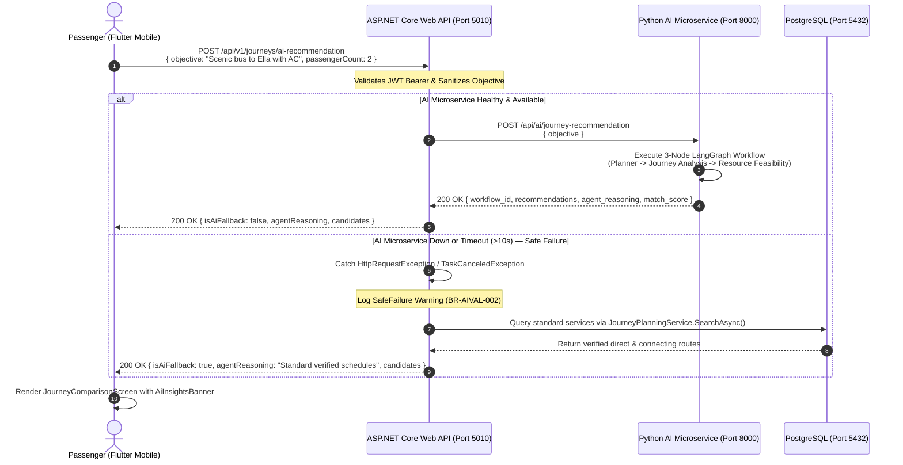

# Mobile Customer AI Journey Recommendations — Design Specification

> **Feature**: Customer-Facing AI Journey Recommendation on Flutter Mobile  
> **Date**: 2026-10-06  
> **Status**: Approved  
> **Component Owner**: Student 1 (Sethum - Journey Planning) & Student 2 (Nuhadh - Mobile Integration)  
> **Architecture Decisions**: [ADR-003 — AI Orchestration](../../adr/ADR-003-ai-orchestration.md) | [ADR-006 — Headless Architecture](../../adr/ADR-006-headless-architecture.md)

---

## 1. Executive Summary & Problem Context

In the SE3090 assignment reference scenario (**AutoCare AI**), customers directly trigger agentic AI workflows by submitting natural language objectives through the mobile client. In the existing **WayPoint** implementation:
- The Python AI microservice provides a 3-agent journey recommendation workflow (`POST /api/ai/journey-recommendation` in `ai/main.py`), and a web client helper is defined in `web/src/features/journey/journeyApi.js`.
- However, the customer-facing Flutter mobile application (`mobile/lib/features/journey/screens/journey_search_screen.dart`) currently relies solely on a structured manual form (origin/destination city pickers, date selector, passenger count).
- Passengers lack a direct, interactive interface to leverage the AI subsystem for intelligent transit queries such as:
  > *"Find the fastest morning bus to Ella with AC for 2 passengers under Rs. 5,000."*

This specification details the end-to-end design to introduce an **AI Journey Recommendation Prompt Card** into the Flutter mobile application, backed by an authoritative **ASP.NET Core Web API Gateway** that safely invokes the Python LangGraph microservice with automatic **Safe-Failure** fallback.

---

## 2. Architectural Boundaries & Compliance

To strictly adhere to the project directives in [`AGENTS.md`](file:///c:/Users/Nuhad/Documents/GitHub/WayPoint/AGENTS.md):
1. **Zero Direct Client-to-AI Coupling**: Flutter mobile clients **must never** communicate directly with the Python FastAPI microservice (`http://localhost:8000`) or PostgreSQL (`REQ-TECH-06`). All mobile requests must flow through the authenticated ASP.NET Core Web API (`http://localhost:5010/api/v1`).
2. **Authoritative Application Layer**: ASP.NET Core validates passenger JWT tokens, sanitizes natural language inputs, manages timeouts, and controls response formatting.
3. **Deterministic Safe Failure (`BR-AIVAL-002`)**: If the Python AI microservice, LangGraph pipeline, or Google Gemini LLM encounters a timeout ($>10$ seconds), service outage, or runtime exception, the backend intercepts the failure and falls back to deterministic journey planning (`JourneyPlanningService.SearchAsync`), returning candidate transit schedules with an `isAiFallback: true` indicator. The mobile application never crashes or presents a dead-end error state.

---

## 3. End-to-End System Sequence & Data Flow



---

## 4. ASP.NET Core Backend Gateway Specification

### 4.1. Controller Endpoint
Add to [`backend/WayPoint.API/Controllers/JourneySearchController.cs`](file:///c:/Users/Nuhad/Documents/GitHub/WayPoint/backend/WayPoint.API/Controllers/JourneySearchController.cs):

```csharp
[Authorize]
[HttpPost("ai-recommendation")]
[ProducesResponseType(typeof(AiJourneyRecommendationResponseDto), StatusCodes.Status200OK)]
[ProducesResponseType(typeof(ProblemDetails), StatusCodes.Status400BadRequest)]
public async Task<ActionResult<AiJourneyRecommendationResponseDto>> GetAiRecommendations(
    [FromBody] AiJourneyRecommendationRequestDto request,
    CancellationToken cancellationToken);
```

### 4.2. DTO Contracts
Create in `backend/WayPoint.Application/Features/JourneyPlanning/DTOs/`:

```csharp
public sealed record AiJourneyRecommendationRequestDto
{
    public required string Objective { get; init; }
    public int PassengerCount { get; init; } = 1;
    public DateTime? TravelDate { get; init; }
}

public sealed record AiJourneyRecommendationResponseDto
{
    public Guid WorkflowId { get; init; }
    public string Status { get; init; } = "Completed";
    public string AgentReasoning { get; init; } = string.Empty;
    public bool IsAiFallback { get; init; }
    public IReadOnlyList<JourneyCandidateDto> Candidates { get; init; } = Array.Empty<JourneyCandidateDto>();
}
```

### 4.3. HTTP Client & Service Interface
Create `IAiRecommendationClient` and implementation `AiRecommendationClient`:
* Injected via `IHttpClientFactory` configured with `BaseAddress = "http://localhost:8000"` (or `AI_SERVICE_URL` env variable) and a 10-second timeout.
* Translates between backend domain DTOs and the Python microservice schema (`WorkflowRequest` / `WorkflowResult`).
* Implements robust exception wrapping for HTTP 5xx, connection refused, and timeout.

---

## 5. Flutter Mobile UI/UX Specification

### 5.1. Explore Tab: `AiJourneyPromptCard`
Located at the top of [`mobile/lib/features/journey/screens/journey_search_screen.dart`](file:///c:/Users/Nuhad/Documents/GitHub/WayPoint/mobile/lib/features/journey/screens/journey_search_screen.dart):
* **Visual Card**: Container with subtle gradient (`#0F172A` to `#1E293B` in dark mode, light slate in light mode) with rounded corners (`16px`) and an accent badge: `✨ AI Trip Planner`.
* **Prompt Input**: An interactive `TextField` with hint: *"Ask AI: 'Morning bus to Ella with AC for 2 under Rs. 5,000'"*.
* **Preset Prompt Chips**: Horizontal scrollable list of quick-suggestion chips:
  1. 🌿 *"Scenic route to Ella with AC"*
  2. ⚡ *"Fastest to Kandy before noon"*
  3. 🏖️ *"Southern coastal to Galle"*
  4. 🛡️ *"Semi-luxury with extra legroom"*
  * Tapping any chip immediately populates the input field and triggers a subtle haptic feedback (`HapticFeedback.selectionClick()`).
* **Search Button**: Primary rounded button with sparkle icon (`Icons.auto_awesome`), loading spinner when `_isAiSearching == true`.

### 5.2. Results Screen: `AiInsightsBanner`
Located in [`mobile/lib/features/journey/screens/journey_comparison_screen.dart`](file:///c:/Users/Nuhad/Documents/GitHub/WayPoint/mobile/lib/features/journey/screens/journey_comparison_screen.dart):
* **State Flag**: `isAiGenerated = true`, `agentReasoning`, `isAiFallback`.
* **Banner Component**:
  * **When AI Succeeded**: Displays an informational panel with agent reasoning:
    > *"AI Insight: Evaluated 4 candidate options. Prioritized Route EX-08 for shortest travel time (3h 15m) and guaranteed AC seat availability."*
    * Highlight badge: `✨ 96% Match`.
  * **When Safe Failure Triggered**: Displays a graceful advisory notice:
    > *"Showing verified direct and connecting routes matching your destination (AI offline)."*
* **Candidate List**: Re-uses existing `JourneyCandidateCard` components, displaying departure/arrival schedules, transfer buffers, fares, and the *"Select Seats"* action button.

### 5.3. Mobile API Service Layer
Update [`mobile/lib/features/journey/services/journey_api_service.dart`](file:///c:/Users/Nuhad/Documents/GitHub/WayPoint/mobile/lib/features/journey/services/journey_api_service.dart):
```dart
Future<AiJourneyRecommendationResult> getAiRecommendations({
  required String objective,
  int passengerCount = 1,
  DateTime? travelDate,
}) async {
  // POST to /journeys/ai-recommendation
  // Handles response parsing, fallback flag, and candidates mapping
}
```

---

## 6. Guardrails, Security & Performance

| Guardrail / Rule | Technical Enforcement |
|:---|:---|
| **Authentication** | ASP.NET Core `[Authorize]` evaluates JWT Bearer token before dispatching to AI. |
| **Input Sanitization** | `Objective` string length capped at 500 characters; whitespace trimmed; special characters sanitized to prevent prompt injection (`FR-AI-008`). |
| **Microservice Timeout** | 10-second cap on Python LangGraph HTTP call. |
| **Safe Failure** | Automatic fallback to `JourneyPlanningService.SearchAsync()` on timeout or HTTP failure (`BR-AIVAL-002`). |
| **Network Security** | Python microservice port 8000 binds strictly to internal container network; only ASP.NET Core is exposed to client networks. |

---

## 7. Testing & Verification Plan

### 7.1. Backend Unit & Integration Tests (`backend/WayPoint.Tests`)
1. **`GetAiRecommendations_ValidObjective_ReturnsRecommendationsAndReasoning`**:
   * Mocks `IAiRecommendationClient` returning 2 candidate routes.
   * Asserts HTTP 200 OK, `IsAiFallback == false`, and valid candidates list.
2. **`GetAiRecommendations_AiServiceUnavailable_FallsBackToDeterministicSearch`**:
   * Mocks `IAiRecommendationClient` throwing `HttpRequestException`.
   * Asserts HTTP 200 OK, `IsAiFallback == true`, and candidate routes populated from database.
3. **`GetAiRecommendations_EmptyObjective_ReturnsBadRequest`**:
   * Submits empty string for `Objective`.
   * Asserts HTTP 400 Bad Request.

### 7.2. Mobile Widget & Integration Tests (`mobile/test`)
1. **`journey_search_screen_test.dart`**:
   * Verifies `AiJourneyPromptCard` renders with text field and preset chips.
   * Verifies tapping preset chip populates the input controller.
   * Verifies pressing *"Ask AI"* invokes the API client and navigates to comparison screen.
2. **`journey_comparison_screen_test.dart`**:
   * Verifies `AiInsightsBanner` displays agent reasoning when `agentReasoning` is provided.
   * Verifies fallback banner displays when `isAiFallback == true`.

---

## 8. Implementation File Inventory

| Component | Target File | Action |
|:---|:---|:---|
| **Backend DTOs** | `backend/WayPoint.Application/Features/JourneyPlanning/DTOs/AiJourneyRecommendationDtos.cs` | Create |
| **Backend Service Interface** | `backend/WayPoint.Application/Features/JourneyPlanning/IAiRecommendationClient.cs` | Create |
| **Backend Client Implementation** | `backend/WayPoint.Infrastructure/Services/AiRecommendationClient.cs` | Create |
| **Backend DI Registration** | `backend/WayPoint.Infrastructure/DependencyInjection.cs` | Modify |
| **Backend Controller** | `backend/WayPoint.API/Controllers/JourneySearchController.cs` | Modify |
| **Backend Tests** | `backend/WayPoint.Tests/JourneySearchControllerTests.cs` | Modify/Create |
| **Mobile Service** | `mobile/lib/features/journey/services/journey_api_service.dart` | Modify |
| **Mobile Models** | `mobile/lib/features/journey/models/journey_models.dart` | Modify |
| **Mobile UI - Prompt Card** | `mobile/lib/features/journey/widgets/ai_journey_prompt_card.dart` | Create |
| **Mobile UI - Search Screen** | `mobile/lib/features/journey/screens/journey_search_screen.dart` | Modify |
| **Mobile UI - Insights Banner** | `mobile/lib/features/journey/widgets/ai_insights_banner.dart` | Create |
| **Mobile UI - Comparison Screen** | `mobile/lib/features/journey/screens/journey_comparison_screen.dart` | Modify |
| **Mobile Tests** | `mobile/test/features/journey/journey_ai_search_test.dart` | Create |
